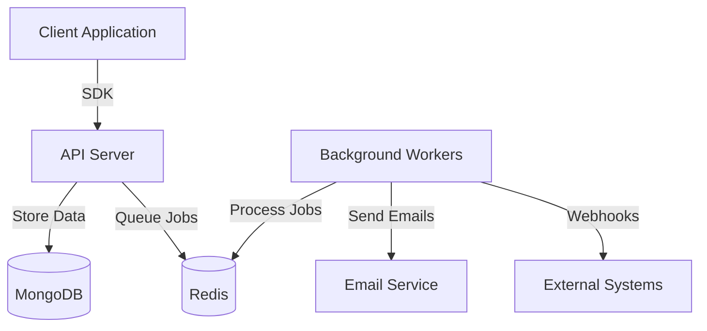

# Architecture

Formiq follows a microservices-inspired architecture, separating the core API server from background processing workers, with a client SDK for easy integration.

## Components

### 1. API Server (`/server`)
- **Framework**: Express.js with TypeScript.
- **Runtime**: Bun (optimized for performance).
- **Database**: MongoDB (via Mongoose) for persistent storage of projects, submissions, and user data.
- **Authentication**: Better Auth for secure user management.
- **Queue Producer**: Adds jobs (e.g., "send email", "process webhook") to BullMQ queues in Redis.

### 2. Background Workers (`/workers`)
- **Framework**: Node.js/Bun script.
- **Queue Consumer**: Listens to BullMQ queues in Redis.
- **Tasks**:
    - Sending email notifications.
    - Processing webhooks.
    - Data aggregation/analytics (future).

### 3. SDK (`/sdk`)
- **Language**: TypeScript.
- **Purpose**: Provides a simple interface for frontend developers to send form submissions to the Formiq server.
- **Features**:
    - `submitForm`: Main function to send data.
    - React Hooks: `useFormiq` for easy integration in React apps.

## Data Models

### Project Schema
The `Project` model represents a form or a collection of forms.

| Field | Type | Description |
| :--- | :--- | :--- |
| `projectId` | String | Unique human-readable identifier (e.g., `user-project-timestamp`). |
| `name` | String | Display name of the project. |
| `owner` | ObjectId | Reference to the `User` who owns the project. |
| `keys` | Object | Contains `publicKey` (for client-side) and `privateKey` (for server-side). |
| `authorizedDomains` | Array | List of domains allowed to submit to this project (CORS). |
| `emailNotifications` | Boolean | Whether to send email alerts on new submissions. |
| `email` | String | Email address to receive notifications (defaults to owner's email). |

### Submission Schema
The `Submission` model stores individual form entries.

| Field | Type | Description |
| :--- | :--- | :--- |
| `projectId` | ObjectId | Reference to the `Project`. |
| `fields` | Object | The actual form data (flexible schema). |
| `ipAddress` | String | IP address of the submitter. |
| `userAgent` | String | Browser/Client user agent string. |
| `origin` | String | The domain from which the submission originated. |

## Detailed Data Flow

### Form Submission Lifecycle

1.  **Client-Side**:
    *   User fills out a form on a website using the Formiq SDK.
    *   SDK sends a `POST` request to `/api/v1/submissions/project/:projectId/submit`.
    *   Request includes `X-Formiq-Key` (Public Key) and form data.

2.  **Server-Side (API)**:
    *   **Rate Limiting**: Checks if the IP has exceeded submission limits.
    *   **Validation**: Verifies the Public Key matches the Project ID and checks if the `origin` is in `authorizedDomains`.
    *   **Persistence**: Saves the submission to MongoDB (`Submission` collection).
    *   **Queueing**: Pushes a job to the `emailQueue` in Redis with the submission details.
    *   **Response**: Returns `201 Created` to the client.

3.  **Background Worker**:
    *   **Job Pickup**: BullMQ worker picks up the job from Redis.
    *   **Processing**:
        *   Checks if `emailNotifications` is enabled for the project.
        *   If yes, uses SendGrid to send an email to the project owner.
    *   **Completion**: Marks the job as completed in Redis.
